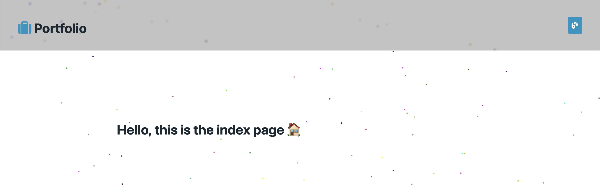

# Ivan's Portfolio

Cool Open Source Portfolio made with [Pug](pugjs.org), [SCSS](https://sass-lang.com/documentation/syntax#scss), [Picocss](picocss.com) CSS library & [Parceljs](https://parceljs.org/) bundler

## Install & Use

After download this repo:

1.  `yarn` command to install all dependencies
2.  `yarn start` to start a local web server and preview the blog site
3.  `yarn build` to to bundle all and prepare to upload

## LICENSE

- This is an open source project under MIT license, more in [LICENSE](LICENSE)
- The artistic content and design is under [Creative Commons BY 4.0](http://creativecommons.org/licenses/by/4.0/) license
